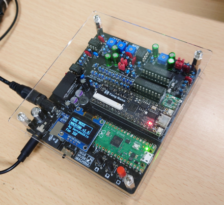
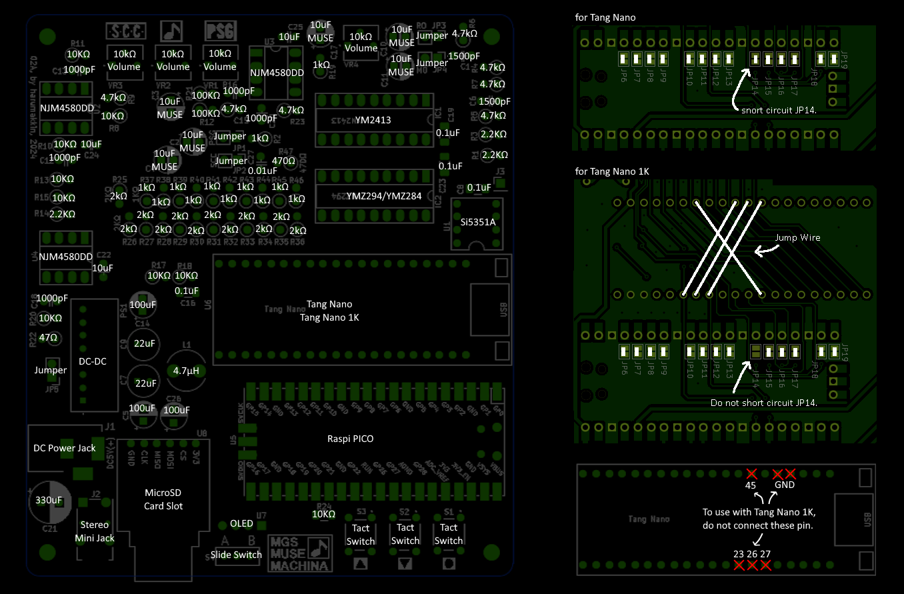

# MGSPICO2 (MGS MUSE MACHINA)
2025/06/28 harumakkin

 **fig.1 MGSPICO2**

## これは何？
OPLL、PSG、SCCの音源とRaspberryPi Picoを実装し、[MGSDRV](https://gigamix.jp/mgsdrv/)と[勤労五号(KINROU5.DRV)](https://sakuramail.net/fswold/music.html#muskin)を使用して、MGSとMuSICA楽曲データ再生し鑑賞できる個人製作のハードウェアです。VGMファイルも再生できます(圧縮形式の.vgzファイル二は対応していません）
さらに、ファームウェアver1.14から、[NDP - PSG Driver for MSX](https://ndp.squares.net/web/)も使用できるようになりNDP楽曲データも再生できるようになりました。
[MGSPICO](https://github.com/cliffgraph/MGSPICO)は、MSX用音源カートリッジを別途用意し使用していましたがMGSPICO2では音源部分もワンボード化したものです。
MGSPICO2と呼称していますが機能的にはMGSPICOと変わりありません。"2"は過剰かなと思いまして、MGS MUSE MACHINAは別称を持っています。
この作品は多く廃版部品を使用しているので、製作はおすすめしません。

## 使い方
### 用意するもの
- MGSPICO2(MGS MUSE MACHINA)
- [MGSDRV.COM(Ver3.20)](https://gigamix.jp/mgsdrv/)
- MGS楽曲データファイル（.MGSファイル）
- [KINROU5.DRV(Ver2.00)](https://sakuramail.net/fswold/music.html#muskin)
- MuSICA楽曲データファイル（.BGMファイル）
- [NDP.BIN(Ver1.03)](https://ndp.squares.net/web/)
- NDP楽曲データファイル（.NDPファイル）
- microSD カード
- DC5V電源(センタープラス 2.1mm DCプラグ）

### microSD カードの準備、セットアップ
- [MGSPICO](https://github.com/cliffgraph/MGSPICO)と同様です。

## 操作方法
- [MGSPICO](https://github.com/cliffgraph/MGSPICO)と同様です。
- ~~MGSPICOとは異なり、MGSPICO2ではA/Bスイッチが有りますがこれはB側に切り替えたまま使用してください。~~ A/Bスイッチ(MODEスイッチ）は修正履歴を参照してください。

## ガーバーデータと部品表と注意事項
TangNanoとTangNano1Kのどちらを使用するかで、内容が異なります。ご注意ください。
- MGSPICO2-xxx/ ディレクトリ内を参照のこと。はんだ付けの難度は高いです。
- MGSPICO2-02A基板のシルクには誤りがあります。VR1（PSGのボリューム）の近くのC15とR16のシルクの位置が逆でした。VR1に近い方がC15、遠い方がR16です。
- raspberry Pi Picoにインストールするファイルは、RasPiPico/dist/mgspico2.uf2 です
#### TangNanoを使用する場合
- TangNanoに書き込むファイルは、RasPiPico/dist/mmmscc.fs です
- MGSPICO2-02A基板背面のJP6からJP19の全14箇所のJPは、全てハンダでショートしてください
#### TangNano1Kを使用する場合
- TangNano1Kを使用する場合は、RasPiPico/dist/mmmscc_tn1k.fs です
- MGSPICO2-02A基板背面のJP6からJP13、JP15からJP19の計13箇所のJPを、全てハンダでショートしてください
- JP14のみオープンのままにしてください。
- TangNano1Kの6本のピンを除去してください（"for TangNano1k" in figure.1）
- MGSPICO2-02A基板背面の導線を使用して一部ピンをつないでください。（"JumpWire" in figure.1）
#### YMZ294-Dの代わりにYMZ284-Dを使用する
- YMZ294-Dが入手できない場合、YMZ284-Dも使用できます。YMZ284-DはYMZ294-Dに比べ端子の数が2ピン少ないです。YMZ284-Dを実装るときは、１番ピン側（切り欠き側）に寄せて実装して下さい。

**figure.1**

# LICENSEと利用に関する注意事項
1. MGSPICOのファームウェアとそのソースコード、回路図データおよび資料ファイルは MIT License で配布されます。ただし、MGSPICO は、FatFsと8x16文字フォントを使用しています。FatFs/8x16文字フォントのソースコードの扱いに関しては各々のLICENSEに従ってください。
2. 本作品は同人ハードウェア＆ソフトウェアです。本作品の設計およびソフトウェアは品質を保証していません。音源カートリッジや音響設備、その周辺機器が故障、破損したとしても自身で責任を負える方のみ本作品をご利用ください。特にハードウェアの製作を伴いますのでリスクがあります。製作の腕に自身のある方のみご利用ください。
3. 本作品の設計資料とソースコードの改変や改造、また、別の作品への利用、商用利用は自由です。ただし、1. 2.の制限を超える利用は各自でその責任と義務を負ってください。

### MGSPICOが組込利用しているソフトウェア(PICO-SDK以外)
- FatFs Copyright (C) 20xx, ChaN, all right reserved. http://elm-chan.org/fsw/ff/00index_e.html
- 8x16 文字フォント FONT8X16MIN.h https://github.com/askn37/OLED_SSD1306
- mmmscc.fs wave_table_sound https://github.com/hra1129/wave_table_sound (mmmscc.fsはwave_table_soundをMGSPICO2用途に一部修正を加えたものです）

### 起動時に読み込んで使用しているソフトウェア
- MGSDRV (C) Ain./Gigamix https://gigamix.jp/mgsdrv/
- 勤労５号（MuSICA互換ドライバ）
(C) 1996,1997 Keiichi Kuroda / BTO(MuSICA Laboratory) All rights reserved. https://sakuramail.net/fswold/music.html#muskin
- NDP (PSG Driver for MSX)
Programmed by naruto2413 https://ndp.squares.net/web/

## 修正履歴
|date|MGSPICO2|firmware|note|
|:--|:--|:--|:--|
|2025/05/25|－|mgspic_2.uf2(v1.14)|NDP音源ドライバに対応しました。NDP楽曲データファイルは.NDP拡張子をつけてください  players.com、playersk.com は必要なくなりました。SDカードから players.com、playersk.com を削除してかまいません|
|2024/09/01|－|mgspico_2.uf2(v1.13)|スイッチ入力の反応が悪くなることがあるので、チャタリング対策を変更して改善した|
|2024/07/26|－|－|TangNnao1k用の"mmmscc_tn1k.fs"を公開しました。|
|2024/07/23|－|mgspico_2.uf2(v1.12)|・一部のVGMファイルはSCC音源チップのパラメータを初期化せず楽曲が始まるデータがあり、前に再生した曲データによって聴こえ方が変わってしまうことがありました。VGM(TGF)の再生前にSCC音源チップのすべてのパラメータを0クリアするようにしました ・MGSPICO2では、SCC音源の音がPSG音源とFM音源の音に比べすこし高音に聞こえてしまっていました。SCCへのクロック周波数を調整し、問題を解決しました。|
|2024/07/19|－|mgspico_2.uf2(v1.11)|SCC+を使用するVGM/TGFデータを再生しても鳴らない問題を修正しました。MGS、MuSICAはSCC+を使用していないのでMGS、MuSICAは変わりありません|
|2024/07/03|－|mgspico_2.uf2(v1.10)|[MGSPICO](https://github.com/cliffgraph/MGSPICO) v1.10相当です - MGSPICO と同様、●スイッチを押しながら電源を入れるとSETTINGモードになります - MGSPICOと異なりMGSPICO2にはMODEスイッチがあります。このバージョンでは、MODEスイッチをB側にして電源をONするとSETTINGの状態に関係なく240MHzで動作するようになります。A側ではSETTINGで指定している速度で動作します|
|2024/06/02|MGSPICO2-02A|mgspico_2.uf2(v1.6)|初版、MGSPICO v1.5相当です|

## 余禄
MGSPICO2 の機能に関係ないですが、開発中に見つけたものをメモ書きしておきます。
##### 特になし、、、
##### その他
- ~~MGSPICOのRaspberryPiPicoはCPUのクロックアップを行っていません。mgspico2.uf2ファームウェアは標準の125MHzのままで動作しています。~~
- mgspico2.uf2ファームウェアはMGSPICOには使用できません。MGSPICO2のファームウェアもMGSPICOには使用できません。ただし、SDカードはそのまま使用できます。

## 謝辞
- mgspico2.uf2(v1.12)で解決しました、VGMファイルの曲データによって聴こえ方が変わってしまうことと、SCC音源の音がすこし高音に鳴ってしまう問題は、[kashiwaさん(@kashiwa)](https://twitter.com/kashiwa)に発見していただき、解決先も調査いただきました。さらに、figure.1(diagram-MGSPICO2-02A.png)を作図し提供していただきました。ありがとうございます！

